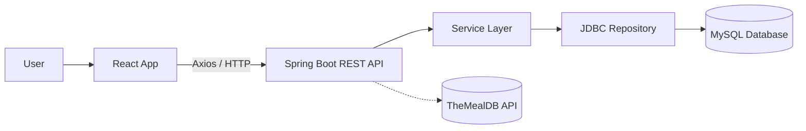
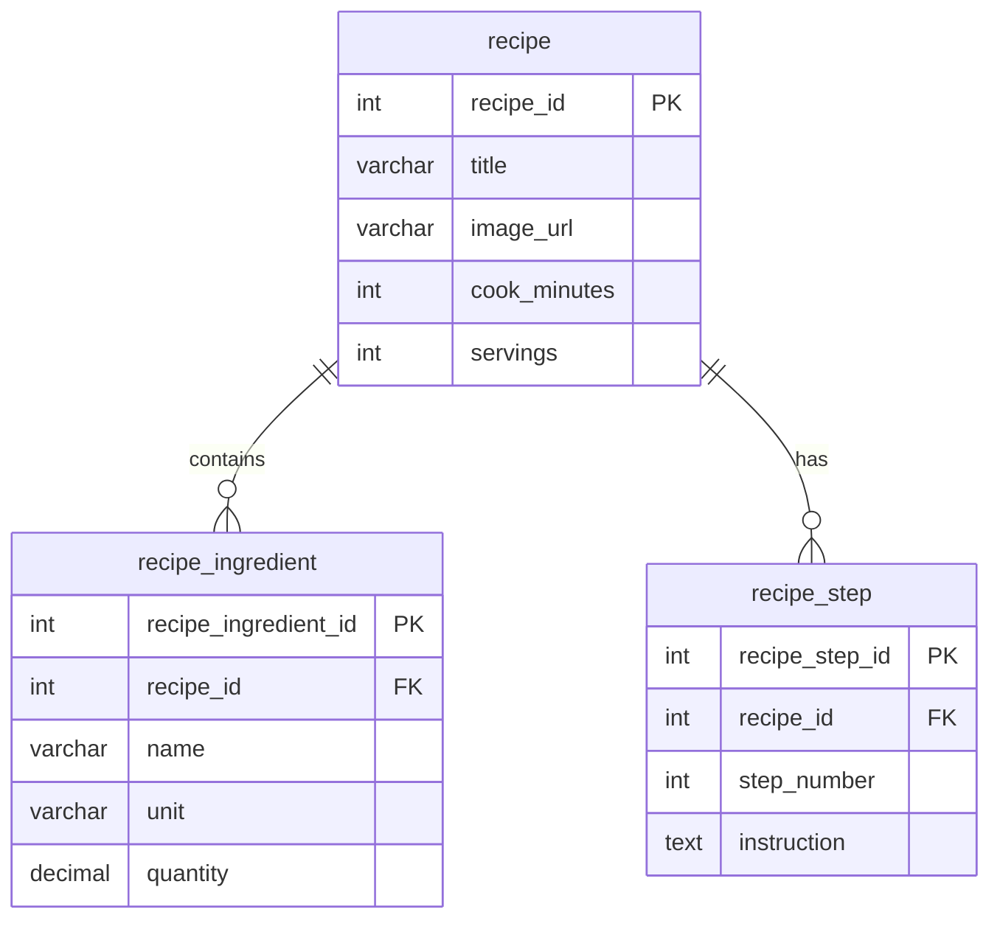

# 🍲 Recipe App — Full Stack Capstone Project

## 📖 Overview
The **Recipe App** is a full-stack web application that allows users to:
- Search recipes from the [TheMealDB API](https://www.themealdb.com/api.php).
- View recipe details (ingredients, instructions, images).
- Save favorite recipes into a **MySQL database**.
- Edit or delete saved recipes (full CRUD support).
- Enjoy a stretch goal: **live image preview** when editing recipes.

This project demonstrates my skills in **Java Spring Boot, MySQL, and React** as part of a Full Stack Capstone assessment.

---

## 🛠 Tech Stack

### Frontend
- React (Vite)  
- JavaScript / HTML / CSS  
- React Router (routing)  
- Axios (API calls)  

### Backend
- Java 17  
- Spring Boot (MVC + REST)  
- Spring JDBC / JdbcTemplate  
- Maven (build & dependencies)  

### Database
- MySQL 8.x  
- Tables: `recipe`, `recipe_ingredient`, `recipe_step`  

### APIs & Tools
- TheMealDB (public API)  
- Postman (API testing)  
- JUnit 5 (backend tests)  
- Mermaid (diagrams)  
- GitHub (version control & docs)

---

## 🏗 System Architecture



## 🏗 System Architecture

- **React Frontend** → UI and user interactions.  
- **Spring Boot Backend** → REST controllers, service layer, repository layer.  
- **MySQL Database** → stores saved recipes with normalized schema.  
- **TheMealDB API** → external recipe source.  

---

## 🗄 Database Design

### Schema
- **recipe** → core table (`recipe_id`, `title`, `image_url`, `cook_minutes`, `servings`).  
- **recipe_ingredient** → ingredients linked by `recipe_id`.  
- **recipe_step** → step-by-step instructions linked by `recipe_id`.  


## 🎨 UI / UX

### Key Screens
- **Search Dashboard** → query TheMealDB API (e.g., “chicken”).  
- **External Recipe Detail** → shows ingredients, steps, and “Save to My Recipes” button.  
- **My Recipes Dashboard** → list of saved recipes.  
- **My Recipe Detail** → view, edit, or delete saved recipes.  
- **Edit Recipe** → update fields + live image preview (stretch goal).  

---

## 🔑 Core Features
- **CRUD**: create, read, update, delete saved recipes.  
- **Dashboard**: list all saved recipes.  
- **Async integration** with external API (TheMealDB).  
- **Stretch Goal**: live preview of recipe image when editing.  
- **Feedback**: alerts on save/edit/delete actions.  
- **Responsive** design works on desktop & mobile.  

---

## ⚡ Challenges & Solutions
- **Async frontend/backend issues** → fixed with Vite proxy + Axios.  
- **Database normalization** → separated recipes, ingredients, and steps into 3 tables.  
- **Auth issues** → simplified scope by removing Spring Security to focus on CRUD.  
- **UI clarity** → added visible Edit/Delete buttons and alerts for better UX.  

---

## 🚀 Future Enhancements
- Add authentication (Spring Security / OAuth) so recipes are tied to users.  
- Improve notifications with toast messages instead of alerts.  
- Add tagging and local search inside saved recipes.  
- Provide data visualizations (popular ingredients, average cooking times).  
- Deploy to the cloud (AWS, Netlify, or Heroku).  

---

## 📦 Setup & Run Instructions

### Prerequisites
- Java 17  
- Maven  
- MySQL 8.x  
- Node.js (>= 18) + npm  

### Backend
```bash
cd recipe-backend
mvn spring-boot:run

```

### Database
```sql
SOURCE schema.sql;
SOURCE data.sql;

```
### Frontend
```bash
cd recipe-frontend
npm install
npm run dev
Runs at: http://localhost:5173

```
## ✅ Testing
- Postman collections for REST endpoints (CRUD).  
- JUnit tests for repository + service layers.  
- Manual frontend tests with sample queries.  

---

## 🎯 Conclusion
This capstone project demonstrates end-to-end full stack development:
- Designing a normalized relational schema.  
- Building a RESTful backend with Spring Boot.  
- Creating an interactive frontend with React.  
- Integrating an external API.  
- Delivering a functional app with a stretch goal.  
